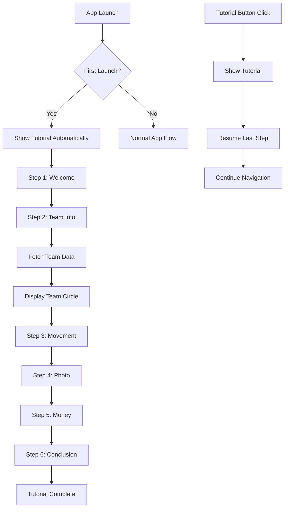

# Tutorial System Technical Documentation

## Overview

The tutorial system provides a comprehensive onboarding experience for new users, guiding them through the core gameplay mechanics of the Vibing conquest game. The implementation follows the specification in `spec/tuto.md` with a 6-step interactive popup system.

## Architecture

### Core Components

1. **TutorialDialog** - Main dialog class managing tutorial flow
2. **HomeFragment Integration** - Tutorial button placement and first launch detection
3. **Team Color System** - Dynamic color loading with Firebase integration
4. **Navigation Controls** - Step-by-step navigation with state persistence

## Implementation Details

### TutorialDialog Class

**Location**: `app/src/main/java/com/example/vibing/ui/tutorial/TutorialDialog.java`

**Key Features**:
- 6-step progressive tutorial with content validation
- Team color display using circular indicators
- Firebase integration for real-time team data
- State persistence across app sessions
- Memory-efficient content management

**Methods**:
- `showNextStep()` - Navigate forward with boundary checks
- `showPreviousStep()` - Navigate backward with boundary checks
- `updateStepContent()` - Update UI based on current step
- `fetchTeamInfoFromFirebase()` - Asynchronous team data retrieval
- `setCircleColor()` - Dynamic circular color rendering

### UI Layout

**Location**: `app/src/main/res/layout/dialog_tutorial.xml`

**Components**:
- Full-screen overlay with semi-transparent background
- Material Design card for content container
- Navigation buttons with intelligent state management
- Team color indicator (visible only on step 2)
- Step indicator showing current progress

### Tutorial Steps

1. **Welcome & Concept Introduction**
   - Welcomes player to Vibing
   - Explains conquest game concept
   - Mentions zone control mechanics

2. **Team & POI Demonstration**
   - Displays user's team name
   - Shows team color as circular indicator
   - Explains POI color representation system

3. **Movement & Capture Interface**
   - Explains POI proximity requirements
   - Details capture vs surrender options
   - Mentions virtual money earning
   - Explains score system and time decay

4. **Photo Validation Process**
   - Photo capture requirements
   - Quiz completion steps
   - Point threshold explanation

5. **Money System Tutorial**
   - 20 steps = 1€ earning mechanism
   - Bonus purchasing for quiz assistance
   - UI section highlighting

6. **Conclusion & Encouragement**
   - Tutorial completion message
   - Team fighting encouragement
   - Good luck wishes

### Team Color Implementation

**Enhancement**: Replaced text-based color names with visual circular indicators

**Features**:
- Firebase real-time color loading
- Fallback color mapping for common team colors
- Caching mechanism for performance
- Error handling with graceful degradation

**Color Mapping**:
- Rouge/Red → `android.R.color.holo_red_dark`
- Bleu/Blue → `android.R.color.holo_blue_dark`
- Vert/Green → `android.R.color.holo_green_dark`
- Orange → `android.R.color.holo_orange_dark`
- Violet/Purple → `android.R.color.holo_purple`

### Integration Points

#### HomeFragment Integration
**Location**: `app/src/main/java/com/example/vibing/ui/home/HomeFragment.java`

**Features**:
- Tutorial button placement (top-right per spec)
- First launch detection using file system
- Tutorial dialog lifecycle management
- POI marker passing for map interactions

#### SharedPreferences Management
**Key**: `"VibingPrefs"`

**Stored Values**:
- `username` - Player's chosen name
- `team_id` - Firebase team identifier
- `team_name` - Team display name
- `team_color` - Team color name
- `team_color_hex` - Team color hex code (cached)

#### Firebase Integration
**Collection**: `teams`

**Fields Retrieved**:
- `name` - Team display name
- `color` - Team color name
- `colorHex` - Team color hex value

## Data Flow

## State Management

### Tutorial States
- **INITIAL** (0): Welcome screen
- **TEAM_DISPLAY** (1): Team information with color circle
- **MOVEMENT_EXPLANATION** (2): POI movement and capture options
- **PHOTO_VALIDATION** (3): Photo and quiz process
- **MONEY_SYSTEM** (4): Virtual money explanation
- **CONCLUSION** (5): Final encouragement message

### Persistence
- Current step saved to `SharedPreferences`
- Tutorial completion tracked to prevent re-showing
- Team information cached for offline functionality

## Accessibility Features

### Visual Design
- Material Design components for consistency
- High contrast text for readability
- Color-blind friendly team indicators
- Semantic button labels

### Navigation
- Previous/Next buttons with clear state indication
- Close button for immediate dismissal
- Keyboard navigation support
- Screen reader compatibility

## Performance Optimizations

### Memory Management
- Lazy loading of team data from Firebase
- Efficient state persistence
- Minimal object creation during navigation
- Proper dialog lifecycle management

### Network Efficiency
- Team color caching to reduce Firebase calls
- Asynchronous data loading with loading states
- Fallback mechanisms for offline scenarios

## Error Handling

### Firebase Failures
- Graceful fallback to default team colors
- Cached data usage when network unavailable
- User-friendly error messages

### UI State Errors
- Boundary checks for navigation
- Proper dialog cleanup on dismissal
- State restoration on configuration changes

## Testing Strategy

### Test Coverage Areas
1. **Dialog Lifecycle** - Creation, display, dismissal
2. **Navigation Logic** - Step boundaries, button states
3. **Content Validation** - Step text accuracy and formatting
4. **Team Color System** - Firebase integration, fallbacks
5. **HomeFragment Integration** - Button functionality, first launch

### Test Files
- `TutorialDialogTest.java` - Core dialog functionality
- Test files created for comprehensive spec validation

## Future Enhancements

### Potential Improvements
1. **Animated Transitions** - Smooth step transitions
2. **Interactive Demos** - Live POI demonstration
3. **Progress Indicators** - Visual completion tracking
4. **Localization** - Multi-language support
5. **Accessibility Improvements** - Voice guidance options

## Configuration

### Build Requirements
- Android SDK 28+
- Material Design Components
- Firebase Firestore
- OSMDroid for map integration

### Dependencies
- Firebase Firestore for team data
- Material Design Components for UI
- AndroidX for modern Android support

## Maintenance Notes

### Regular Updates Needed
- Team color mapping updates
- Content localization additions
- Accessibility compliance checks
- Performance monitoring

### Monitoring Points
- Tutorial completion rates
- Firebase query performance
- User navigation patterns
- Error occurrence frequency

---

**Last Updated**: January 18, 2026
**Version**: 1.0
**Specification**: `spec/tuto.md`